codeit curriculum


1. 프로그래밍 기초 in python(3일)
2. 객체 지향 프로그래밍(3일)
4. 알고리즘의 정석(10일)
5. 자료구조(7일)
6. SQL 데이터베이스(7일)
7. 클라우드 컴퓨팅 (2일)ra
8. 데이터 사이언스 입문(5일)
9. 머신 러닝(10일)
9. python 중급, 웹 퍼블리싱- 반응형 웹 퍼블리싱(3일)

## 프로그래밍 기초 in python

## 추상화 개요

### 추상화 : 변수, 함수, 객체

- 변수: 값을 저장하는 것 
- 함수: 명령을 저장하는 것

계속 반복되는 값을 변수의 이름으로 추상화시킴으로써 반복으로 인한 에러와 이해를 돕고, 만약 값이 바뀌었을 때 용이하게 하기 위해 변수를 사용

자주 쓰이는 내장함수가 있고, 사용자 정의 함수가 있음

parameter: 함수에 넘겨주는 값

return: 함수에서 돌려주는 값

함수가 실행된 후 위치가 return값으로 치환된다.

### 기타 연산

몫 연산(버림) : //

반올림 : round 함수

### format method

```python
print('오늘은 {}년 {}월 {}일 입니다.'.format(year, month, day))
date_string = '오늘은 {1}월 {0}년 {2}일 입니다.'#이렇게 순서 바꿀수도 있음
print(date_string.format(year,month,day))
print("{:.4f}".format(3.14159265))
```

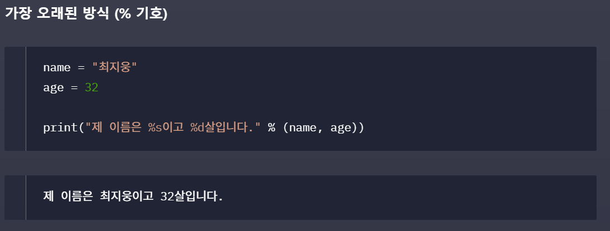


## global을 써야하는 상황

```python
x = 1 # 전역변수 x
def my1():
	x += 1
    print(x)
    
def my2():
    y = 10
    print(x+y) #11
    
def my3():
    global x
    x += 1
    print(x) #2
    
#my1() # 에러
my2()
my3()
```

my1에서는 x를 초기화하였는데 기존의 x값이 my1 내에 없으므로 실행한다면 error가 난다.

my2에서는 x를 초기화하지 않고 참조하였으므로 전역변수 x를 사용하였다.

my3에서는 전역 변수 x를 사용한다고 선언하고 x에 1을 더했으므로 x의 값이 2로 바뀌게 된다.


**PEP8**을 보며 파이썬 스타일 가이드 참고하자

### list 함수

- sorted : 기존 리스트는 건드리지 않고, 정렬된 새로운 리스트를 리턴
- sort: 아무것도 리턴하지 않고, 기존 리스트를 정렬

- del(list[index])
- list.insert(index, element)
- numbers.sort(reverse=True) 역순으로 sorting

위치 바꾸기 응용

temp 사용

(a,b) = (b,a)

a,b = b,a 로도 바꿀 수 있음!!


### dictionary

key : value의 꼴로 선언하는 구조, key를 통하여 value를 빠르게 찾도록 설계되어 있다

```python
dic = {
    5 : 25,
    2 : 4,
    3: 9
}
dic[5]  #5에 해당하는 value인 25가 출력된다
dic[6] = 'six' #추가할 수 있다
print(dic.values()) # dic.values()에서 list처럼 반환된다--> in 사용 가능
print(dic.keys())
print(dic.items()) # [key, value]의 list로 반환된다
```


### alias(별칭)

```python
x= [2,3,4,5,6]
y = x # y는 x의 alias이다!
y[2] = 6
print(x)
print(y)# 같은 배열이 출력된다.
y = list(x) #x의 복사본이 y에 대입된다. y는 x의 alias가 아니다!
y[2] = 9
print(x)
print(y)# 두값이 다르게 출력된다
```

list의 경우 mutable하고 alias가 가능하다. 따라서 **<u>함수의 파라미터에 list를 넘겨주어서 함수 내에서 바꾼다면 이는 바꿔지지만(alias가 전달되기 때문), 파라미터에 일반 정수를 넘겨준다면 함수 내에서 파라미터를 바꾸더라도 바뀌지 않는다(복사본이 전달되기 때문)</u>**

### module

`import calculator`과 같이 같은 디렉토리의 파일 `calculator.py`을 모듈화하여 가져올 수 있다.

`calculator.add(2,4)`와 같이 .을 사용하여 모듈의 함수에 접근할 수 있다. 하지만, 매번 calculator를 쓰기 귀찮다면, `import calculaotr as calc`와 같이 calc라는 변수처럼 가져올 수 있다. 아니면 특정 함수를 자주 사용할때에는 `from calculator import add, multiply`와 같이 가져올 수 있다. 또는 `from calculator import *`로 모든 함수를 가져올 수 있지만, 이는 권장되지 않는다.

기본적으로 포함되어 있는 모듈들을 standard library라고도 한다.

몇개의 예시를 보도록 한다.

#### random module

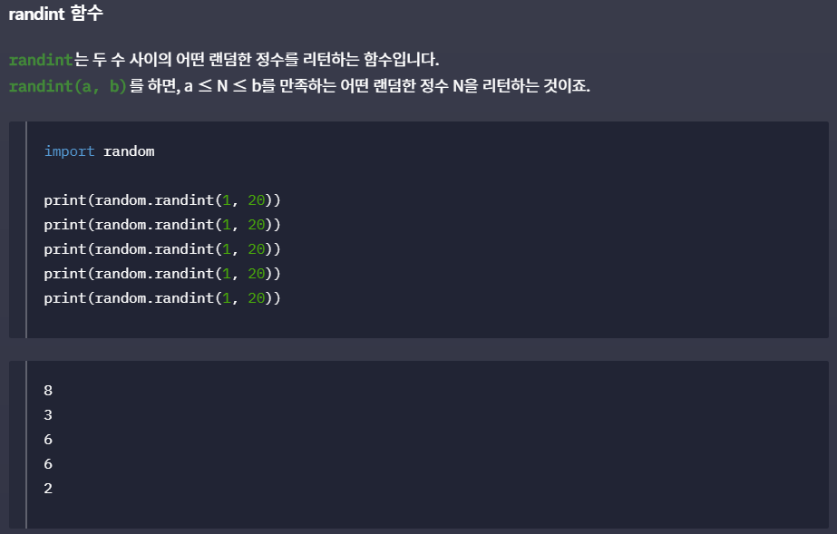

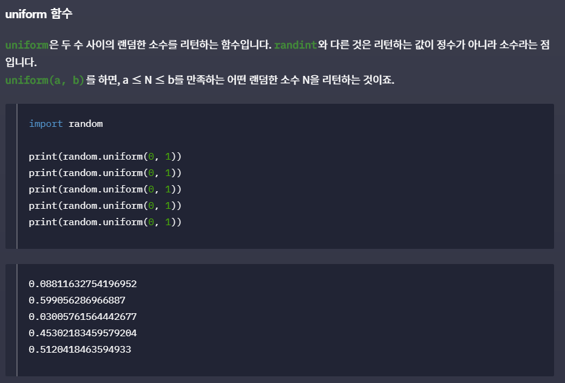

#### datetime module

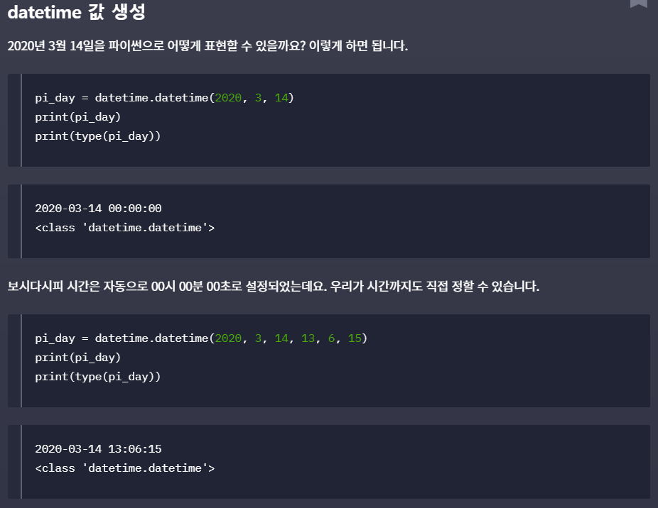

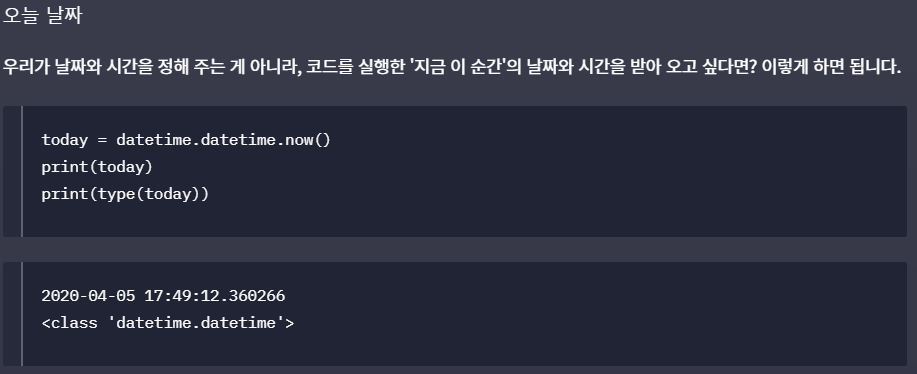

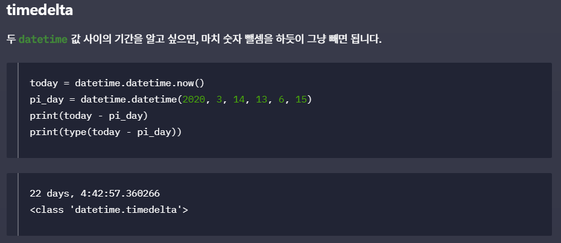

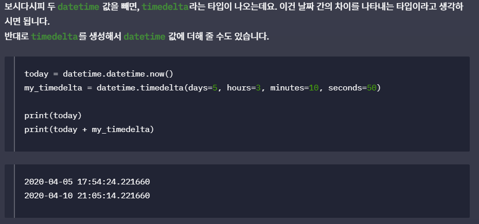

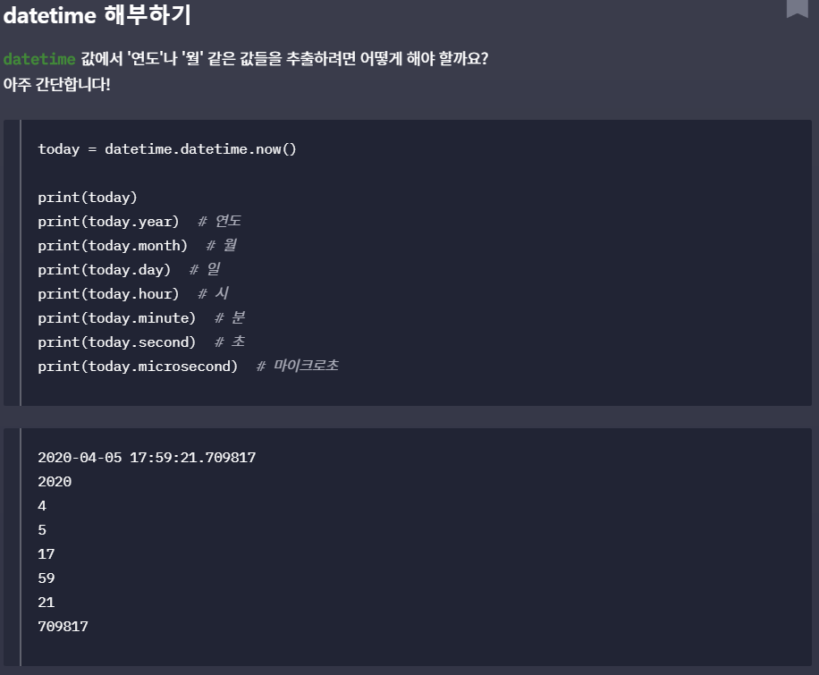


## file open read

`with open('파일명','r') as f:` r: 읽기 권한 , f : f로 사용하기 위해서... 쓸 때는 r이 아닌 w로 쓰면 되겠다. 이때는 write()함수 사용한다. 새로운 파일 만들어서 쓸때는 a로 해주자...

fild의 type은 list는 아니지만 list와 비슷하게 사용할 수 있다.

만약 `UnicodeDecodeError`가 나오게 된다면 open을 `with open('chicken.txt', 'r', encoding='UTF-8') as file:`와 같이 인코딩 인자를 추가해준다. 

chicken.txt의 구성...

```txt
1일 : 90469
2일 : 54055
3일 : 45361
```

만약에 줄별로 출력하면 각 줄마다 한 줄씩 더 띄워져 있는 것을 볼 수 있다. 이것은 txt파일이 `1일 : 90469\n`과 같이 한 줄의 data를 저장하고 있기 때문이다. + print에서 자체적으로 \n이 된다.

#### strip method

양끝의 white space(개행 포함)를 지워줄 수 있다.


## 객체 지향 프로그래밍

객체 : 속성과 행동을 갖고 있음

객체 지향 프로그래밍: 프로그램을 객체 사이의 소통으로 바라보는 것!

<-> 절차 지향: 함수가 코드에서 주체로 동작

 객체의 틀(class)을 가지고 객체(instance)를 만들어낼 수 있다.

### class 생성

```python
class User:  #항상 대문자로 작성해야 함
	pass # 아무 내용이 없다는 뜻

user1 = User()	#class로 instance를 생성, user1이 User instance를 가리키게 됨
```

객체의 속성에 해당하는 인스턴스 변수를 정의해보자. 다음과 같이 객체를 생성한 이후에 만들 수 있다.

```python
class User:
    pass
user1 = User()
user1.name = '채동진'
user1.email = 'thinkingjjin@gmail.com'
user1.password = 'fajsdow124'
print(user1.email)
print(user1.age) 	#error! instance 변수 정의해놓지 않았기 때문
```

객체의 행동을 나타내는 함수를 메소드라고 한다. 메소드에는 인스턴스 메소드, 클래스 메소드, 정적 메소드의 3개가 있다.

1. **인스턴스 메소드**: 인스턴스 변수를 사용할때 항상 사용한다.

   ```python
   class User():
       def say_hello(some_user):
           print(f'안녕하세요 저는 {some_user.name}입니다.')		#User의 인스턴스 변수를 사용한다
   	def login(some_user, my_email, my_password):
           if some_user.email == my_email and some_user.password == my_password:
               print("login success!")
   user1 = User()
   user1.name = '채동진'
   User.say_hello(user1)	#클래스에서 메소드를 호출
   user1.say_hello() #같은 결과가 나온다!
   
   user1.email = "thinkingjjin@gmail.com"
   user1.password = 'fajsdow124'
   user1.login(user1, "thinkingjjin@gmail.com", 'fajsdow124') #error!
   user1.login("thinkingjjin@gmail.com",'fajsdow124')
   ```

   `user1.say_hello()`에서는 파라미터를 넘겨주지 않았는데,  이래도 괜찮다! 왜냐하면, 인스턴스에서 메소드를 부를때 **디폴트로 인스턴스가 첫 파라미터로 들어가기 때문**이다.

   이와 같이 `user1.login()`에서도 첫번째는 기본적으로 user1이 들어가므로 두번째의 방법만 허용된다! 단, 메소드를 정의할때에는 객체를 적어줘야한다.

   #### self를 사용합시다.

   첫번째 parameter는 위에서는 some_user로 사용하였다. 하지만, python에서는 self로 통일하는 것을 권장하고 있다! 앞으로는 인스턴스 메소드의 첫번째 인자는 항상 self로 적어놓도록 하자.

   #### `__init__`메소드 정의하기

   인스턴스 변수를 여러줄에 일일이 지정해주면 귀찮다. 따라서 클래스 안에서 init method를 미리 정의하여 객체 생성시 바로 인스턴스 변수를 초기화해줄 수 있다.

   이름 앞뒤로 _(underscore)가 2개씩 붙은 것들을 python에서는 magic method, special method라고 한다. 또는 double underscore을 줄인 **dunder method**라고도 불린다. 이는 특정상황에서 자동으로 시행되는 메소드이다. 예를 들어 init은 인스턴스가 생성될 때 자동으로 호출된다.

   ```python
   class User:
       def __init__(self, name, email, password):
           self.name = name
           self.email = email
           self.password = password
           
   user1 = User("john","thinasdf@gmail.com","12345")
   ```

   이렇게도 객체를 선언해줌과 동시에 인스턴스 변수의 초깃값을 한번에 설정해줄 수 있다.

   #### `__str__`메소드 정의하기

   만약 print(user1)을 하면 메모리의 주소 등이 나올 것이다. dunder <u>str은 print의 함수를 호출할 때 자동으로 호출된다</u>! print 수행시 dunder str의 string return이 출력됨을 확인할 수 있다. java의 toString과 같다고 볼 수 있다.

   ```python
   class User:
       def __init__(self, name, email, password):
           self.name = name
           self.email = email
           self.password = password
   
   
       def __str__(self):
           return f'이름 : {self.name}, email : {self.email}, password : {self.password}'
   
   
   user1 = User("john", "thinasdf@gmail.com", "12345")
   print(user1)  #이름 : john, email : thinasdf@gmail.com, password : 12345
   ```

   dunder str이 정의되어 있지않다면 일일이 메소드 변수에 접근해서 출력했어야 할 것이다.

   #### 클래스 변수

   인스턴스 변수: 인스턴스 자신만의 속성

   클래스 변수: 여러 인스턴스들이 공유하는 속성(모든 인스턴스들이 같은 값이여야 함)

   ```python
   class User:
       count = 0 	#class 변수 사용
       
       def __init__(self, name, email, password):
           self.name = name
           self.email = email
           self.password = password
           
           User.count += 1 	#user instance가 생성될때마다 count가 1씩 올라갈 것이다.
   print(User.count)
   ```

   이는 항상 User.count와 같이 선언되야 한다. 인스턴스들이 공유하는 클래스의 속성이기 때문이다.

   ```python
   class User:
       count = 0
   
       def __init__(self, name, email, password):
           self.name = name
           self.email = email
           self.password = password
           User.count += 1
   
   
   user1 = User("john1", "thinasdf@gmail.com", "12345")
   user2 = User("john2", "thinasdf@gmail.com", "12345")
   user3 = User("john3", "thinasdf@gmail.com", "12345")
   user4 = User("john4", "thinasdf@gmail.com", "12345")
   
   user1.count = 5		#같은 이름의 인스턴스 변수를 선언한 것
   print(User.count)	#4
   print(user1.count)	#5-->이거는 user1이 count라는 인스턴스 변수를 가져온 것이다.
   print(user2.count)	#4
   ```

   같은 이름의 클래스변수와 인스턴스변수가 있을때에는 인스턴스변수가 호출 된다!

   따라서 이는 혼동을 줄 수 있으니, User.count와 같은 방법으로만 클래스 변수를 설정해주도록 하자.

   ####  *decorator*

   함수를 인자로 받아서 함수를 반환하는 형식, 함수의 기존 form을 활용하여 반복되는 함수의 과정들을 줄일 수 있다.

   다음과 같이 함수가 실행될때마다 시작과 끝을 출력해주는 decorator 함수를 만들 수 있다.

   ```python
   def add_print(func):
       def wrapper():
       	print('함수 시작')
       	func()
       	print('함수 끝')
       return wrapper
   
       
   def func1():
       print('func1!')
       
       
   print_func1 = add_print(func1)
   print_func1()	#아래와 같이 줄여서도 적을 수 있다
   add_print(func1)()
   ```

   하지만 여러함수에 모두 add_print를 추가해준다면 귀찮을 수 있다. 따라서 파이썬에서는 `@`키워드를 추가함으로써 함수를 꾸밀 수 있다.

   ```python
   def add_print(func):
       def wrapper():
       	print('함수 시작')
       	func()
       	print('함수 끝')
       return wrapper
   
   
   @add_print
   def func1():
       print('func1!')
       
       
   func1() #꾸며진 func1 함수가 실행된다!
   ```

   위보다 더 간단하게 함수를 꾸며 새로운 기능을 추가할 수 있다.
   
2. 클래스 메소드

   클래스 변수의 값을 읽거나 설정하는 메소드를 클래스 메소드라고 한다.

   계속 오던 User의 예시를 보자. 클래스 메소드는 `@classmethod`라는 데코레이터를 추가해줌으로써 사용한다!

   ```python
   class User:
       count = 0
   
       def __init__(self, name, email, password):
           self.name = name
           self.email = email
           self.password = password
           User.count += 1
       def __str__(self):
           return f'이름 : {self.name}, email : {self.email}, password : 	  {self.password}'  
       
       ##클래스메소드##
       @classmethod
       def number_of_users(cls):	#class method
          print(f'총 유저의 수 : {cls.count}명')	#cls.count는 위의 User.count와 같은 의미!
           
           
   user1 = User("john1", "thinasdf@gmail.com", "12345")
   user2 = User("john2", "thinasdf@gmail.com", "12345")
   user3 = User("john3", "thinasdf@gmail.com", "12345")
   user4 = User("john4", "thinasdf@gmail.com", "12345")
   
   User.number_of_users()	#총 유저의 수 : 4명
   user2.number_of_users()	#같은 결과
   ```

   클래스 메소드의 첫번째 파라미터는 항상 `cls`로 적어준다. 인스턴스 메소드는 항상 `self`였던 것처럼 이는 파이썬의 규칙이다.

   호출할때는 인스턴스메소드와 마찬가지로 첫번째 인자는 생략한채로 Class, instance를 통하여 모두 호출할 수 있다.

   하지만 여기서 의문이 든다! 왜 굳이 클래스 메소드를 사용할까? <u>인스턴스 메소드도 클래스 변수를 참조할 수 있으므로</u> 같은 결과를 얻을 수 있다. 그러한 이유는 **인스턴스 변수를 사용하지 않기 때문**이다. self를 참조할 일이 없기에 클래스 변수를 사용한다.

   

3. 정적 메소드

   정적 메소드는 인스턴스 변수, 클래스 변수를 전혀 다루지 않는 메소드이다. `@staticmethod`를 함수 위에 사용하도록 한다. 클래스로 인스턴스로 모두 호출이 가능하다. 클래스나 인스턴스의 속성을 다루지 않고, 단지 기능(행동)적인 역할만 하는 메소드를 정의할 때 정적 메소드로 정의한다. 만약 이메일 주소가 유효한지 보기 위해 다음과 같은 함수를 추가한다고 하자.

   ```python
   class User:
   
       def __init__(self, name, email, password):
           self.name = name
           self.email = email
           self.password = password
   
       ##정적 메소드##
       @staticmethod
       def is_valid_email(email_address):
           print('@' in email_address)
   
   
   user1 = User("john1", "thinasdf@gmail.com", "12345")
   user1.is_valid_email(user1.email)	#True
   ```

   물론 위의 예시는 인스턴스 변수를 사용하므로 인스턴스 메소드로 정의하는 것이 더 좋을 수 있으나, 인스턴스 변수나 클래스 변수를 모두 참조하지 않는다면 정적메소드로 사용할 수 있다는 것을 알아두자. 

   변수들의 접근권한으로 보자면 static method << class method << instance method의 포함관계로 나타낼 수 있을 것이다. *즉, 스태틱 메소드로 표현가능한 것은 클래스나 인스턴스 메소드로도 항상 표현이 가능*하다! 하지만 상황에 맞게 적절히 사용하도록 하자.


#### 가변 vs 불변 타입

불변타입은 가리키는 값 자체는 바꿀 수 있다.(아예 새로운 인스턴스를 가리키게 하는 것 ) 하지만, 이미 선언된 속성을 바꾸는 것은 불가능하다! ex. tuple

| 불변  | 가변               |
| ----- | ------------------ |
| bool  | list               |
| int   | dict               |
| float | 사용자 정의 클래스 |
| str   |                    |
| tuple |                    |


#### 유용한 함수들

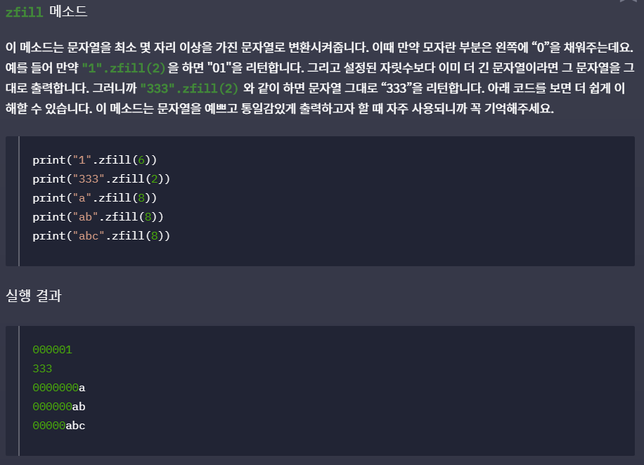

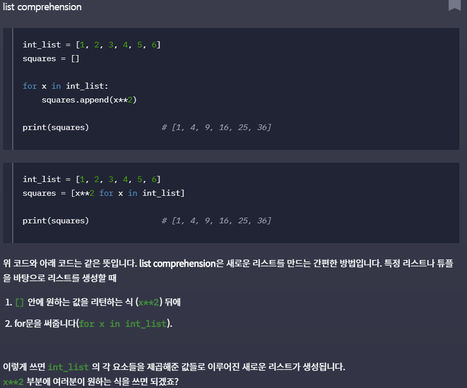

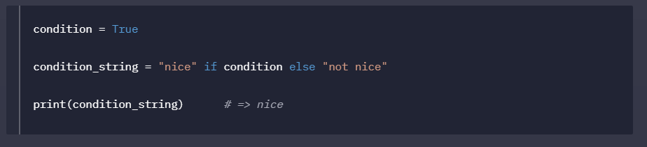


## 객체지향 프로그래밍의 4가지 기둥

### 추상화

몰라도 되는 정보는 감추고, 알아야 하는 필수정보만을 보이는 것 (커피를 마실 때, 커피머신의 모든 원리는 이해할 필요없이 간단하게 커피를 내려 마실 수 있다)

변수, 함수를 사용하는 것도 추상화이다. (선언하면 값을 몰라도 변수명으로 접근할 수 있으므로)

#### 추상화 잘 하기

1. 변수, 함수, 클래스의 이름을 잘 지어서 알아보기 쉽도록 하자.

2. python에서는 docstring(documentation string)으로 정보를 기록하자.(""" 두개 사이에 적어줄 수 있다)

   docstring으로 작성한 후, `help(ClassName)`을 실행하면 클래스의 docstring을 확인해볼 수 있다! 다음의 사진을 참고하여 docstring을 작성하도록 하자.

   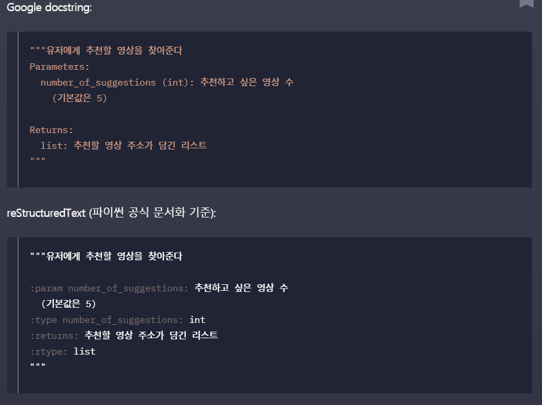

   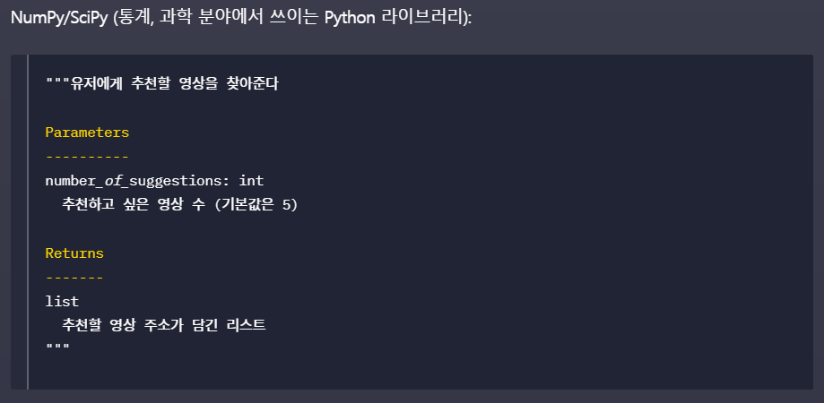

3. type hinting

   가독성을 위해 인자에 타입을 명시하도록 한다. 하지만, 지켜지지 않더라도 실행된다.

   ```python
   def deposit(self, amount: float)-> None:
       self.balance += amount
   ```

   parm의 타입은 :으로, return type은 ->로 표현해준다. 단, python 3.5이상에서 가능하다~
   
   

### 캡슐화

모든 인스턴스 변수에 접근할 수 있다면 바뀌면 안되는 정보들이 보호가 되지 않는다. 따라서 이와 같은 경우에는 클래스에 캡슐화를 해줘야한다.

**캡슐화란**

1. 클래스 외부에서 클래스의 변수에 접근하는 것을 막는 것이다.

   변수 앞에 `__`(underscore 2개)를 붙여줌으로써 외부에서의 접근을 막을 수 있다. 저렇게 선언된 변수 또는 함수는 읽거나 바꿀 수 없다. 이는 `__str__`과 같은 특수메소드와는 다른 것이다.(특수 메소드는 외부에서 접근 가능)

   하지만, 변수를 숨기기만 하면, 변수에 접근할 수 없기 때문에 무용지물이다. 따라서 getter, setter method를 통하여 숨겨진 변수에 접근가능한 메소드를 만들어주어 읽을 수 있도록 한다. <u>인스턴스 메소드에서는 숨겨진 변수도 접근</u>이 가능하므로 이렇게 하면, 값을 읽을수는 있다.

2. 객체의 속성과 그것을 사용하는 행동을 하나로 묶는 것이다.

   getter, setter 등의 메소드를 통하여만 인스턴스 변수에 접근할 수 있도록 한 것이 이에 해당한다. 모든 숨기는 변수에 대하여 getter, setter를 항상 만들 필요는 없다!

   + setter를 만들어주면, `__init__`에서 바로 사용할 수 있다. 인스턴스 변수에 대한 예외처리를 setter에 처리해주고, 인스턴스를 생성할 때부터 올바른 값이 들어오도록 진행할 수 있다.

하지만 파이썬에서는 **언어 차원에서 캡슐화를 지원하지 않는다**.`dir` 라는 함수를 사용하면 인스턴스가 갖고 있는 모든 변수와 메소드를 볼 수 있는데, `__age`변수는 `_Person._age`와 같이 나오는 것을 볼 수 있다. 그럼 `_Person._age`로 접근이 가능한가 보면 가능하고, 값의 변경도 가능하다! 따라서 이는 <u>완벽한 캡슐화라고 볼 수는 없다</u>.

따라서 파이썬 개발자는 캡슐화의 문화를 갖고 있다. 이는 underscore 2개가 아닌 <u>하나로 private한 변수와 메소드를 선언하는 것이다.</u> 이는 아무 의미 없고, 단지 이 변수, 메소드는 클래스 외부에서 직접 접근하지 말라는 경고일 뿐인 것이다.

#### 데코레이터를 사용한 캡슐화

property, setter decorator를 활용하여 getter와 setter를 쉽게 사용할 수 있다. 호출할 때는 단순히 변수명으로 getter와 setter를 실행시킬 수 있다. 이는 기존의 캡슐화가 안되있던 코드를 캡슐화시킬 때 편하게 바꿀 수 있도록 도와준다.

```python
class Citizen:
    drinking_age = 19

    def __init__(self, name, age, resident_id):
        self.name = name
        self._age = age
        self.resident_id = resident_id


    def authenticate(self, id_field):
        return self.resident_id


    def __str__(self):
        return self.name + '씨는 '+str(self._age) +"살입니다"


    @property
    def age(self):
        return self._age

    @age.setter
    def age(self, value):
        self._age = value


eastsea = Citizen('eastsea', '22', '923511-5894021')
print(eastsea)
print(eastsea.age)		#자동으로 property age함수가 실행된다.
eastsea.age = 10		#자동으로 age.setter가 실행된다.
print(eastsea.age)
```

추가로, 변수를 사용할때에는 <u>직접 가져다쓰지 않고 메소드에서 처리하도록</u> 하자. 유지보수에 용이하기 때문이다!

### 상속

A는 B이다. 의 관계가 성립할때 가능하다

`class Cashier(Employee)`의 형태로 상속을 표현할 수 있다. Cashier가 Employee의 자식 클래스

`help(Cashier)` 로 보면 Employee Class의 메소드와 변수가 모두 존재함을 알 수 있다. 또한, `Method resolutino order:`라는 부분이 있는데, 이를 통하여 상속관계를 볼 수 있다. 이는 `Cashier.mro()`로도 확인 가능하다. 모든 클래스는 기본적으로 최상위 클래스인 `object class`의 자식이다.

한 인스턴스가 주어진 클래스의 인스턴스인지 확인하기 위해 `isinstance`함수를 사용할 수 있다.

상속관계에 있는 경우, `isinstance(cashier, Employee)`와 같은 것은 True를 반환하게 될 것이다. 따로 상속관계를 확인하기 위해서는 `issubclass`함수를 사용할 수 있다.

```python
class Employee:
    company_name = 'moms touch'
    raise_percentage = 1.03

    def __init(self, name, wage):
        self.name = name
        self.wage = wage

    def raise_pay(self):
        self.wage *= self.raise_percentage

    def __str(self):
        return Employee.company_name + '직원 : ' + self.name


class Cashier(Employee):    #상속관계를 나타냄
    raise_percentage = 1.05 #변수 override
    burger_price = 4000     #자식에만 있는 변수

    def __init(self, name, wage, number_sold):
        super().__init__(name, wage)      #super()함수로 부모 클래스의 메소드를 실행할 수 있다.
        self.number_sold = number_sold

    def take_order(self, money_received):
        if Cashier.burger_price > money_received:
            print(' no money')
            return money_received
        else:
            self.number_sold +=1
            change = money_received - Cashier.burger_price
            return change

    def __str__(self):
        return Cashier.company_name + '계산대 직원 :' + self.name


class DeliveryMan(Employee):
    pass

print(Cashier.mro())    #mro 순서대로 메소드를 실행하므로, 같은 이름의 변수와 메소드로 override가 가능하다
                        #mro: method resolution order: 메소드 검색 순서
cashier = Cashier('east', 8900,0)

```

이와 같이 상속을 사용하면, `DeliveryMan`도 훨씬 적은 코드로 만들 수 있을 것이다.

#### 다중 상속

클래스 선언시 여러개 적으면 된다.

하지만, `__init__`에서 `super()`가 어느부모인지 알 수 없다는 문제점이 있다. 또한, 여러 부모의 `__str__`이 모두 실행될 수 없으므로, `mro`기준 앞에 있는 클래스가 실행되게 된다. 이러한 문제로 `Java`와 같은 언어에서는 다중 상속을 지원하지 않는다.

파이썬에서 다중상속은 다음과 같은 해결방법이 있다.

1. 부모클래스끼리 같은 이름의 메소드를 갖지 않도록 하기
2. 같은 이름의 메소드는 자식클래스에서 오버라이딩

위의 곤란한 경우들이 있으므로, 필수적이지 않다면 다중상속은 자제하도록 하자.


### 다형성

하나의 변수가 여러 클래스의 인스턴스를 가리킬 수 있는 성질

#### 추상 클래스

`from abc import ABC, abstractmethod`를 추가해줘야 한다. abc는 `abstract basic class`이다. 추상클래스는 ABC를 상속한다.

추상메소드는 자식클래스가 반드시 오버라이딩해야하는 메소드이다. 추상메소드는 앞에 `@abstractmethod`를 decorator로 사용해주도록 한다. 추상클래스는 적어도 하나 이상의 추상메소드를 가지고 있어야 한다. 추상메소드에서는 `type hinting`을 사용하여 무슨 값을 리턴할 지 미리 적어주도록 가이드를 주는 것도 좋은 방법이다!

추상 클래스로는 인스턴스를 만들 수 없다. 이는 여러 클래스를 공통점을 담아두고, 다른 클래스가 이를 기반으로 인스턴스를 생성하도록 하는 것이다.

