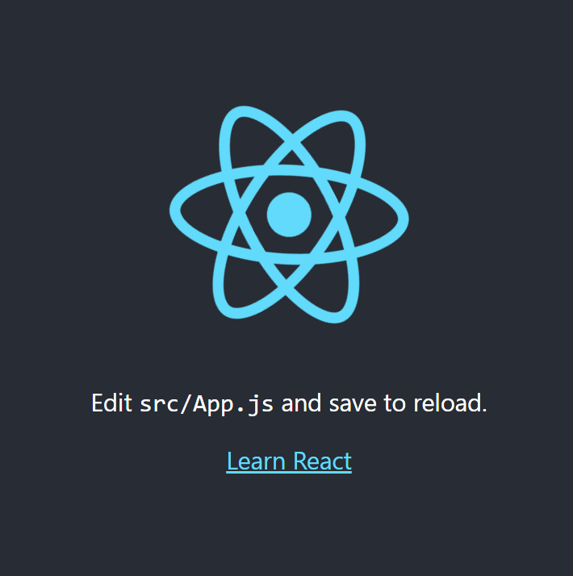
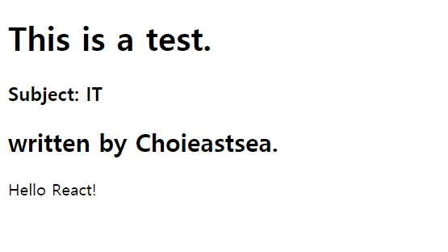
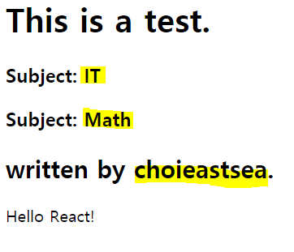
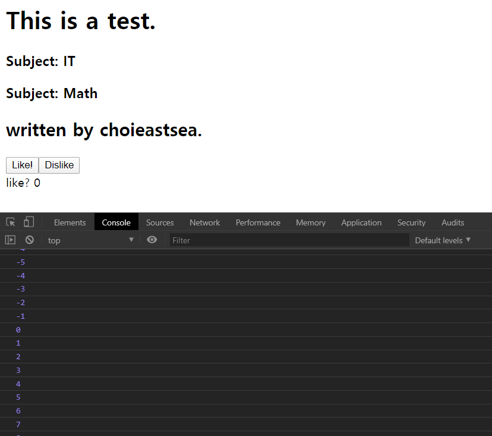
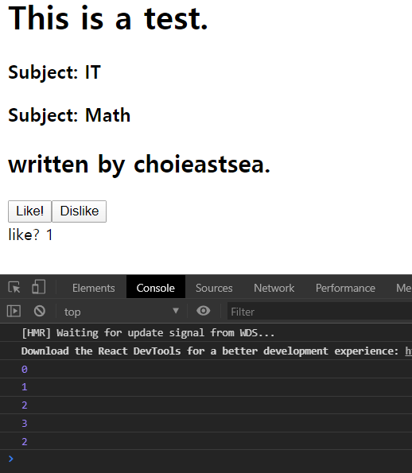

단계별로 git commit 링크를 제공하므로 천천히 따라오면 될 것 같다.

## CRA란?

> Create React App

`facebook`에서 개발되었다고 알려진 `react Js`를 쉽게 시작하기 위해서 사용하는 패키지로 알고 있다. 리액트의 개념에 익숙해지기 전에 개발 환경을 만드는 것 부터 질릴까두려워 `CRA`를 활용하여 나의 첫 리액트 프로젝트를 만들어보려 한다. 아직 나는 리액트의 장점이 뭔지 모른다! 배우면서 차근차근 알아봐야겠다.

나의 현재 상태는

- 코딩을 해본적은 있다.
- html, css, js로 동적인 페이지를 만들 수 있다.
- git을 사용할 줄은 알지만, branch 관리나 이런거는 못한다.
- 최신 버전의 js 문법은 모르니 필요한 것들은 쓰면서 배울 것이다.
- 리액트를 배워보고 싶다.

이므로 참고하길 바란다.


## Setting

우선, `npm`과 `npx`가 깔려있는 것이 편하다. 해당 프로젝트 디렉토리로 이동하여 이하의 커맨드를 실행하자.

```bash
npx create-react-app appName
cd appName
npm start
```

appName은 app이름으로 적어주면 된다.

`npm start`를 하면 로컬 웹 페이지가 열릴 것이다. 우선은 아래와 같이 나온다.



이렇게 나온다면 세팅은 끝이다 :-)

이제 이것저것 만져보기 전에 리액트의 개념을 살짝 알아보자.


## react의 간단한 개념

리액트Js를 통하여 html과 css, 그리고 js로 이루어져 있는 프론트엔드 영역(클라이언트가 접하는 영역)을 한번에 처리할 수 있다고 들었다. 그럼 리액트는 웹 페이지를 어떤 측면에서 바라볼까?

인스타그램의 pc 메인 페이지를 보면,


우리는 이것을 볼때 크게 아래와 같이 직관적으로 나눌 수 있을 것이다.(내 느낌대로 나눠보았다)


진할수록 연한 색의 컴포넌트보다 위에 위치할 것이다. 연한 색의 컴포넌트는 진한 색의 컴포넌트를 가지고 있는 형태를 띨 것이다. 

예를 들어서 나는 Left 컴포넌트와 Right 컴포넌트로 나누고, Left 컴포넌트에는 img 앨리먼트를 넣을것이다. Right 컴포넌트에는 크게 Login 컴포넌트, Register 컴포넌트, Download 컴포넌트로 나눌 것이다. 이런 식으로 나누어서 각각의 컴포넌트를 작업하여 점진적으로 컴포넌트를 포함시켜 페이지에 `render`시켜주는 것이 리액트라고 볼 수 있다.

컴포넌트가 대충 어느 것인지 알 것 같다...

> 리액트의 기본 단위는 컴포넌트이다.
>
> 컴포넌트로 만들어진 것이 엘리먼트(element)이다.

그리고 컴포넌트는 ~.js 파일로 존재할 수 있다.(참고로 모든 컴포넌트는 대문자로 시작한다) 가장 기본 컴포넌트는 `App`컴포넌트이다. App.js를 통하여 App엘리먼트가 rendering되면 웹 페이지가 완성되는 것이라고 볼 수 있을 것 같다. 

좀 더 자세히 들어가는 것은 뒤에 해보면서 알아봐야겠다:)


## Hello React!

모든 파일을 사용하진 않을거라, 파일을 간단하게 정리를 하고 시작했다.

`src`디렉토리에는 `App.js`와 `index.js`만 남기고 삭제하였다.

```javascript
//App.js
import React from 'react';

function App() {
  return (
    <div>Hello React!</div>
  );
}

export default App;

//index.js
import React from 'react';
import ReactDOM from 'react-dom';
import App from './App';

ReactDOM.render(
  <App />, document.getElementById('root'));

```

위와 같이 파일 내용을 수정하고 `yarn start`를 해주면 빈 창에 `Hello React!`가 나오게 된다.

이후, 파일을 <u>수정하고 저장만하면 실시간으로 변경사항이 업데이트</u> 되는 것을 볼 수 있다!(터미널을 종료하지만 않으면 됨) 참 편한 거 같다.

App.js를 보면,

App()이라는 함수를 통하여 div가 있는 컴포넌트를 만들어진다는 것을 추측할 수 있다.

index.js를 보면,

ReactDOM이라는 객체의 render()를 통하여 HTML의 id가`#root`인 곳에 App이라는 컴포넌트를 뿌려주는 것 같다. 실제로 `index.html`의 `<div id="root">`영역에 나오게 됨을 알 수 있다.

이를 통해 컴포넌트를 만들어 영역에 render시켜줌으로써 웹 페이지를 구성할 수 있다는 것을 알 수 있다.


Hello React! (캡쳐는 따로 안했다)

**[commit 내용 확인하기](https://github.com/choieastsea/cra-react/commit/694cdb24c2786f7017c526c5809845d40fa91b99)**


## JSX(JavaScript XML)

나에게 낯선 표현이 있다. index.js에서 보이는 `<App />`이다. HTML 태그 같지만, App이라는 태그는 없다. react에서는 render를 할 때, component를 만들어서 사용한다는 의미로 Js와 HTML을 합친 꼴의 `JSX`문법을 추가하였다. 우리가 만들 컴포넌트를 가져와서 붙여준다는 뜻으로 이해하면 될 것 같다.


## React Component 작성해보기

리액트 컴포넌트를 작성하는데 크게 두가지 방법이 가능한 것 같다.

1. ~.js 파일로 만들기

   `Test.js`파일로 Test 컴포넌트를 만들어보자.(컴포넌트는 대문자로 시작해야한다고 한다) 

   ```javascript
   //Test.js
   import React from 'react';
   
   function Test() {
       return (
           <h1>This is a test.</h1>
       );
   }
   export default Test;
   
   //App.js
   import React from 'react';
   import Test from './Test'; //directory 구조에 맞게 쓰면 된다.
   function App() {
     return (
       <div>
         <Test />
         Hello React!
       </div>
     );
   }
   export default App;
   ```

   가장 기본적으로 있어야 하는 내용은 `import React from 'react';`와 `export default Test;`가 있어야 한다. 무엇을 export할지 적어주면, 이 컴포넌트를 사용할 곳(위에서는 App.js)에서 `import`해주고 JSX로 컴포넌트를 사용(<Test />)하면 된다.

   function Test(){ return ... ;} 을 통하여 내보낼 엘리먼트에 대한 정보를 작성하면 된다. Test에서는 heading의 내용이 가게 되고, App component에서는 제목과 내용이 들어있는 컴포넌트가 index.html에 들어가게 되는 거라고 볼 수 있을 것 같다.

2. 파일 안에서 만들기

   함수형으로 만들거나 React.Component를 상속하는 클래스형으로도 만들 수 있다.

   ```javascript
   //App.js
   
   import React from 'react';
   import Test from './Test';
   
   function Subtitle() {	//function형 component
     return (
       <h2>written by Choieastsea.</h2>
     );
   }
   class Subject extends React.Component{	//class형 component-->render함수에서 return
     render() {
       return (
         <h3>Subject: IT</h3>
       );
     }
   }
   function App() {
     return (
       <div>
         <Test />
         <Subject />
         <Subtitle />
         Hello React!
       </div>
     );
   }
   
   export default App;
   ```

   - 컴포넌트를 만들어 해당 파일 안에서 사용하는 경우, function을 통하여 컴포넌트 객체를 만들어줄 수 있다. 이러한 방법을 `함수 컴포넌트`라고 한다. `생성자 함수`와 비슷한 것 같다.

   - ES6 class를 사용하여 컴포넌트를 정의할 수도 있다. 이때는 class가 React.Component를 상속(extend)하도록 정의해줘야 한다. 이때, render()안에 return을 통하여 컴포넌트를 정의할 수 있다.

     이 두가지 경우에는 `export`는 파일명에 해당하는 컴포넌트만 해주면 된다. 헷갈리지 않도록 한다.

React application은 한번의 하나의 componenet만 rendering할 수 있다. 따라서 App 컴포넌트에 모든 것을 넣고 index.js에서 App element를 index.html에 랜더링하도록 하자.

어떻게 나올지 예상해보고, 확인하면 끝이다. JSX형식으로 작성하니 직관적이고 편한 것 같다는 생각이 든다!



**[commit 내용 확인하기](https://github.com/choieastsea/cra-react/commit/0ea6e51be5be7b171d13b5093ac25cdeda7a7e5f)**

이제, 컴포넌트에 정보를 남겨주는 방법에 대하여 알아보자. 우선 static info를 넘겨주는 방법부터!


## Property를 이용하여 정적인 정보를 전달하는 방법

위에 사진에서, subject: Math를 *기존의 코드를 활용*하여 추가해보려 한다!

우리는 단지 Component에 property를 추가로 줌으로써 이를 구현할 수 있다. 클래스 컴포넌트와 함수형 컴포넌트 두가지의 방법이 약간 다르므로 둘 다 해보자. 우선은 엘리먼트 생성시, property를 전달해준다. 이하와 같이 App() 함수를 수정하였다.

```javascript
//in App.js...
function App() {
  return (
    <div>
      <Test />
      <Subject subname="IT" />		//subname property 추가
      <Subject subname="Math" />	//subname property 추가
      <Subtitle name="choieastsea" />	//name property 추가
      Hello React!
    </div>
  );
}
//참고로 JSX 사이에 위와같이 comment를 적으면 오류가 날 것이다
```

1. 함수형 컴포넌트에서의 props 다루기(subtitle 예시)

   우리는 함수의 인자로 property 객체를 받아온 후 이를 사용할 수 있다.

   ```javascript
   function Subtitle(property) {
     return (
       <h2>written by {property.name}.</h2>
     );
   }
   ```

   함수형 컴포넌트에서는 인자로 props 객체를 받아올 수 있다. 출력시에는 {...}안에다가 작성해줘야 React가 해당 프로퍼티를 찾아서 치환시켜놓을 수 있다. *만약* name property가 없는 엘리먼트라면 `written by `만 출력이 될 것이다. (name이 undefined이므로!)

2. 클래스 컴포넌트에서의 props 다루기(subject 예시)

   render함수에서 return을 해주었던 클래스 컴포넌트에서는 this연산자를 통하여 props를가져온다.

   ```javascript
   class Subject extends React.Component {
     render() {
       return (
         <h3>Subject: {this.props.subname} </h3>
       );
     }
   }
   ```

   this를 통하여 Subject class의 프로퍼티에 접근할 수 있다. 이때 React Component는 props를 갖고 있나보다. 이를 통하여 우리는 정적인 정보를 보여줄 수 있다. 물론, {...}안에 작성해야 해당 부분이 치환될 것이다. 결과는 이하와 같다.(형광펜으로 정보가 대입된 부분을 표시함)



**[commit 내용 보기](https://github.com/choieastsea/cra-react/commit/46de37f88d9b074247eec874e4143fcbadfaddcb)**

아하~ 이제는 컴포넌트(틀)을 만들어놓고, 갖다가 정보를 입혀서 찍어내기만 하면 될 것 같다는 생각이 든다. 자바를 처음 배울 때, 틀(mold)과 비슷한 class를 정의하고 instance를 만들었던 느낌과 비슷하다!

이제는 `dynamic web page`를 만들기 위해 몇가지를 알아봐야 할 것 같다.


## state를 이용하여 동적인 페이지 만들기

Like 버튼을 누르면 score가 올라가고, Dislike를 누르면 score가 내려가게 하려 한다.

우선, App 컴포넌트를 class 형식으로 변경하고 동적인 data를 갖고 있을 `state` object를 추가해주고, 버튼을 이하와 같이 만들었다.

``` javascript
//in app.js...
class App extends React.Component {
  state = {
    score: 0
  };
  like = () => {// this 사용하기 편하므로 화살표 함수 사용
    this.state.score += 1;
    console.log(this.state.score);
  }

  dislike = () => {
    this.state.score -= 1;
    console.log(this.state.score);    
  };
  render() {
    return (
      <div>
        <Test />
        <Subject subname="IT" />
        <Subject subname="Math" />
        <Subtitle name="choieastsea" />
        <button onClick={this.like}>Like!</button>
        <button onClick={this.dislike}>Dislike</button>
        <br />
        <span>like? {this.state.score}</span>
      </div>
    );//onclick이 아니라 onClick 주의
  };
}
```

직관적으로 버튼을 누르면 state의 score가 올라거나 내려가거나 할 것 같다.**하지만,** 이는 반영되지 않는다. state 객체의 값은 바뀌는데, 이는 반영되지 않는 모습이다.

 

이유를 찾아보니, Component 생성 후 이벤트가 발생할때마다 render를 다시 해줘야 바뀐 부분을 반영할 수 있기 때문이라고. 따라서 우리는 React에서 제공하는 `setState()`함수를 통하여 state가 바뀔때마다 render를 refresh해줘야 한다는 것을 알 수 있다.따라서 like와 dislike 함수를 다음과 같이 수정하였다.

```javascript
like = () => {
    this.setState({ score: this.state.score + 1 });
    //this.state.score += 1;
    console.log(this.state.score);
  }

dislike = () => {
    this.setState({ score: this.state.score - 1 });
    //this.state.score -= 1;
    console.log(this.state.score);
  };
```



**[commit 내용 보기](https://github.com/choieastsea/cra-react/commit/1dbe68229a25baff322ddce9cf455f61ae2bfe71)**

이렇게하니까 잘 되기는 한다. 콘솔을 보면 state값은 1인데 2가 찍히는 것을 볼 수 있다. 이는 setState가 `비동기함수`이기에 setState가 끝나기 전에  console.log(...)가 실행되는 것 같아 보인다.(console.log를 앞으로 뺀것과 같은 결과가 나타나므로)

혹자는 current 함수를 활용하여 setState 부분을 `this.setState(current => ({ score: current.score + 1 }));`로 사용하는 것이 더 현재의 값을 잘 반영한다고 하니 그렇게 수정하긴 했지만, 동기적으로 처리하기 위한 해결책은 아닌 것 같다.

오늘 아주 긴 시간동안, react에 대하여 알아보았다. 다음에는 서버에서 데이터를 받아와서 html에 뿌려주는 실습 비슷한 것을 해봐야겠다.


## reference site

https://ko.reactjs.org/

https://www.slideshare.net/xpressengine/xecon2015-22-react-spa