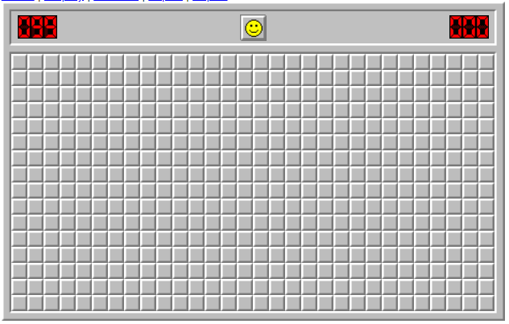
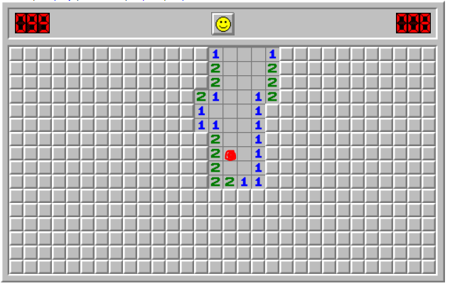
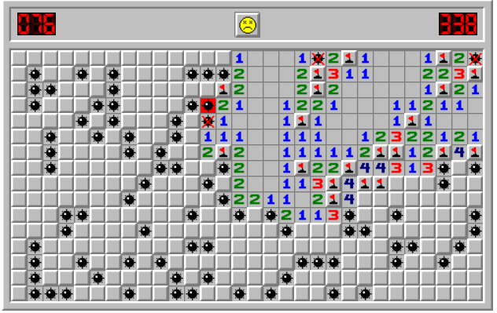
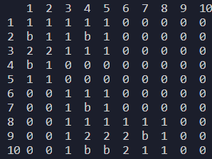
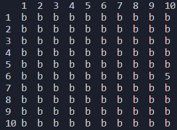
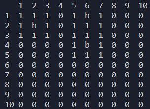
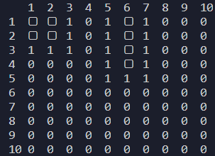

## 시작하기

 파이썬을 간단하게 공부하고 나서, 1학년때부터 내가 코딩을 포기하게 만든 계기인 지뢰찾기를 만들어보려고 한다. 당시는 C++로 했었지만 실패하고 그 이후로 전공수업에 흥미를 잃었다ㅋ 

우선, 지뢰찾기 게임의 룰부터 알고 있는게 좋을 것 같다.

1. m*n 크기의 행렬에서 지뢰가 k개 있다고 할 때, 사용자가 한 칸을 고른다.
2. 고를때에는 지뢰가 있을 것으로 추정되므로 flag를 세울지, 지뢰가 없다고 추정하므로 이 칸을 공개할지를 선택한다.
3. 공개한 칸이 지뢰라면 game over
4. 공개한 칸이 지뢰가 아니라면 그 칸 주변에 몇개의 지뢰가 있는지 숫자가 나온다. 만약 주변에 0개의 지뢰가 있다면 주변의 모든 칸을 공개한다.
   - 주변이라는 것은 칸의 위치에 따라 다르지만 적어도 하나의 꼭짓점을 공유하는 칸이라고 생각하면 될 것 같다. (한가운데 칸 기준으로는 주변 칸은 총 8개)
5. 모든 지뢰의 위치를 flag로 맞추면 게임에서 승리하게 된다!


## 지뢰찾기 게임 예시

구글에 mine sweeper라고 검색하면 나오는 웹 게임도 있고, 예전에는 windows에도 지뢰찾기가 있었던 걸로 기억한다.(지금은 못찾겠다) 아래는 웹에서 검색한 게임의 예시이다.



모든 칸이 지금 cover된 상태이다. mine이 현재 99개 있다는 뜻이다. 나는 아무데나 눌러보겠다.



숫자가 없는 칸은 0과 같으며 주변에 지뢰가 없다는 뜻이다. 빨간 표시가 있는 곳을 눌렀는데 주변 8개에서 더 보여진다. 이는 주변 8개에서 0이 있다면 이전과 같은 작업(주변의 숫자를 모두 공개함)을 **반복**하는 것을 알 수 있다.

공개하거나, flag를 세울 수도 있다. 만약 공개한 것이 폭탄이라면 game over이다. 



위와 같이 멀끔한 게임으로는 콘솔로 한계가 있으므로 키보드 입력을 받아서 진행하는 간단한 게임을 만들어보도록 하겠다! 예외처리나 게임의 윤택함이 목적은 아니므로 최소화하여 *기능상 무리가 없게만 진행*하였다.


## 지뢰 찾기 순서도

우선 지뢰찾기 게임의 흐름은 다음과 같다.

m*n matrix에서 한칸 선택시

1. uncover(공개)

   1. 지뢰->게임 패배

   2. 0이 아닌 숫자->해당 숫자 공개

   3. 0->주변 숫자들 공개

      1. 주변숫자에 0이 아닌 숫자->1-2 수행

      2. 주변숫자에 0 -> 1-3 수행

         +주변 숫자를 공개하는 것은 0일때만 하는 것이므로 지뢰가 직접 공개되진 않는다.

2. flag(깃발 세우기)

   1. 지뢰 위치에 깃발->정답
      1. 지뢰수와 정답 깃발수가 같다면 게임 승리
   2. 지뢰가 아닌 위치에 깃발->오답

이 정도의 흐름을 가져볼 수 있을 것 같다. 1-3의 경우, 상황에 따라 <u>다시 1-2 또는 1-3을 수행</u>할 것이다. 이는 **재귀(recursion)**로 구현하면 되겠다고 생각할 수 있다.


## 행렬 출력하기

`print(matrix)`를 하면 배열의 형식으로만 나오기에 지뢰찾기 게임처럼 사각형의 모양을 보여주는 `print_matrix(field)`함수를 만들어 주었다. 마우스로 클릭하는 것이 아닌 키보드로 입력하는 것이므로 사용자가 보기 쉽도록 행렬의 위치를 자리수에 맞춰서 출력해주었다.

```python
def print_matrix(field):
    '''
    when parameter is matrix,
    print_matrix print out visually squared m*n matrix.
    '''
    print(end='   ')
    for i in range(len(field[0])):
        print(format(str(i+1),"2s"),end=' ')
    print()

    for i in range(len(field)):
        print(format(str(i+1),"3s"), end='')
        for element in field[i]:
            print(element, end='  ')
        print()

```


## 지뢰 임의로 설치하기

게임의 다양성을 위하여 matrix의 크기 m,n와 mine의 갯수 k를 사용자의 입력으로 받도록 하였다. (필수적인 사항 아님)

`plant_mine`함수는 0으로 초기화된 m*n matrix field에 k의 지뢰('b')를 심는 함수이다.

random한 col과 row의 위치에 field를 'b'로 해주었다. 만약 이미 'b'라면(겹치는 상황이므로) 다시 반복하도록 하였다. 또한, 숫자판 만들기(2번째 방법)에 쓰일 수 있어서 지뢰의 행렬 위치를 갖고 있는 mine_list 배열을 추가로 만들어서 반환해주도록 하였다. 

```python
def plant_mine(field,k):
    '''
    plant k mines in field randomly.
    returns 'field' with mines , 'mine_list' which has list of mines coordinates
    '''
    mine_list = []
    i = 0
    while i < k:
        #print('i : ',i)
        row = random.randint(0, len(field)-1) #양 끝값 모두 포함한 범위의 랜덤 정수
        col = random.randint(0, len(field[0])-1)
        #print('row :',row,', col :',col)
        if field[row][col] == 0:
            i += 1
            field[row][col] = 'b'
            mine_list.append([row,col]) #mine_list에는 mine의 matrix coord's list 갖고 있음
        else:
            #print('중복')
            continue
    #print('mine_list : ',mine_list)
    return [field, mine_list]

```


## 숫자판(?) 만들기

실제 지뢰찾기 맵을 보면, 지뢰만 있는 것이 아닌 사용자가 유추할 수 있도록 주변의 지뢰 개수 또한 갖고 있다. (이를 숫자판이라고 일단 부르겠다) 이를 만들기 위해서는 크게 두가지 방법이 있다고 생각하였다.

1. m*n 행렬을 전체 조사하면서 주변 한칸한칸을 모두 조사하며 지뢰를 발견할 때마다 +1씩 해준다.
2. 지뢰의 위치를 갖고 있는 mine_list를 통하여 지뢰 주변을 +1씩 해준다.

첫번째 방법은 m*n개의 반복문이 필요하지만 <u>두번째는 k(지뢰의 갯수)회만 필요하므로 더 효율적이라고 생각하여 진행</u>하였다. 그럼에도 귀찮은 것들이 있었다.

우선, **주변**이라는 말은 칸의 위치에 따라 달라진다. 모서리인 (0,0)의 경우 주변은 (1,0),(0,1),(1,1) 이렇게 세가지가 존재한다. 가장자리의 경우에는 주변은 5칸, 한 가운데의 경우 8칸이다. 경우의 수를 나눠보면 9가지이다.(각 모서리 4개, 가장자리 4개, 한가운데 1개) 아주 귀찮은 작업이지 않을 수 없다. 그래도 이렇게 분기를 나눠놓으면 이후에 재귀문에서도 같은 형식으로 사용할 수 있기에 꾹 참고 하였다.

`make_map`는 field와 mine_list(지뢰의 위치 행렬 리스트)를 통하여 숫자판과 지뢰의 위치까지 갖춰진 map을 반환하는 함수이다. 우선 0으로 초기화된 m*n 배열 map에서 지뢰의 위치 주변을 위치에 따라 +1씩 해주었다. 이미 지뢰가 들어간 배열 field가 아닌 0으로 초기화한 map에서 +1씩 해주는 이유는 다음과 같다.

**만약 지뢰가 이웃하여 있다면, 'b'+1이 되는데 이는 파이썬에서 불가능하다.**  따라서 0으로 초기화된 배열에 숫자만 채워주고 마지막에 다시 'b'를 넣어주었다. 'b'가 들어갈 위치에 있던 숫자는 무의미하므로 가능하다.

```python
def make_map(field,mine_list):
    #print('func make_map')
    map = [[0 for col in range(m)] for row in range(n)]
    for mine_loc in mine_list:
        row = mine_loc[0]
        col = mine_loc[1]
        if row == 0 and col ==0:
            #case1
            map[row][col+1] +=1
            map[row+1][col] +=1
            map[row+1][col+1] +=1

        elif row == 0 and col == len(field[0])-1:
            #case2
            map[row][col-1] +=1
            map[row+1][col] +=1
            map[row+1][col-1] +=1

        elif row == 0:
            #case3
            map[row][col-1] +=1
            map[row][col+1] +=1
            map[row+1][col] +=1
            map[row+1][col+1] +=1
            map[row+1][col-1] +=1
            
        elif row == len(field) - 1 and col == len(field[0])-1:
            #case4
            map[row-1][col] +=1
            map[row][col-1] +=1
            map[row-1][col-1] +=1

        elif col == len(field[0])-1:
            #case5
            map[row+1][col] +=1
            map[row-1][col] +=1
            map[row][col-1] +=1
            map[row+1][col-1] +=1
            map[row-1][col-1] +=1

        elif row == len(field)-1 and col == 0:
            #case6
            map[row-1][col] +=1
            map[row][col+1] +=1
            map[row-1][col+1] +=1

        elif col == 0:
            #case7
            map[row+1][col] +=1
            map[row-1][col] +=1
            map[row][col+1] +=1
            map[row+1][col+1] +=1
            map[row-1][col+1] +=1

        elif row == len(field)-1:
            #case8
            map[row][col+1] +=1
            map[row][col-1] +=1
            map[row-1][col] +=1
            map[row-1][col+1] +=1
            map[row-1][col-1] +=1

        else:
            #case9
            map[row+1][col] +=1
            map[row-1][col] +=1
            map[row][col+1] +=1
            map[row][col-1] +=1
            map[row+1][col-1] +=1
            map[row+1][col+1] +=1
            map[row-1][col+1] +=1
            map[row-1][col-1] +=1
        
    for mine in mine_list:
        map[mine[0]][mine[1]] = 'b'
    return map

```

우선 여기까지의 중간결과를 확인해야한다. 나중에 뭔가 잘못되었을 때, *여기까진 문제가 없었다*는 것을 확인해야 하기 때문이다.



10*10 배열에 7개의 지뢰를 임의로 설치하였다. 행, 열 끝의 숫자는 print_matrix에서 보기 좋게 하기 위함이므로 무시해도 좋고, 'b'가 끝에 있더라도 index error를 일으키지 않고 숫자가 올바르게 되어있다는 것을 알 수 있다.



10*10 배열에 99개의 지뢰를 설치해보았다. 지뢰가 99개 다 들어가있고, 숫자도 올바르게 5가 되어있다. 여기까진 완벽하다!

이제 지뢰찾기를 하기위한 준비가 되었다. 이제 한 칸을 선택하면 그것을 uncover할지, flag를 세울지 정하고 어떻게 되는지를 작업하면 될 것 같다.


## flag 세우기

uncover하는 과정은 또 9개의 경우를 나눠야하고 상황에 따라 재귀로 들어가기 때문에 만만한 이녀석부터 해보자.

일단 게임을 진행하기 위한 상수들을 정의해보자. 숫자판에 해당하는 mine_map은 지뢰찾기의 '답지'에 해당하므로 사용자가 못 보도록 해야한다. 따라서 사용자가 보면서 게임을 진행 할 user_map을 정의해주었다. 특수문자 '▢'로 가득찬 이녀석은 ▢가 cover된 상태이거나 나중에 사용자가 선택하면 숫자가 나오게 될 것이다. **일단 ▢는 아직 공개가 안된 상태라는 것을 유념해두자.**

```python
field = [[0 for col in range(m)] for row in range(n)]
user_map = [['▢' for col in range(m)] for row in range(n)]
[field, mine_list] = plant_mine(field, k)
#mine_map : answer sheet of mine_sweeper
mine_map = make_map(field, mine_list)
#print_matrix(mine_map) #겜할때는 없애야함
print_matrix(user_map)
score = k
flag_num = 0
```

총 지뢰의 갯수 k는 사용자가 다 flag로 찾을 경우 승리하게 된다. 따라서 score 변수를 정하고 flag와 mine의 위치가 일치할때마다 하나씩 빼주도록 할 것이다. 아래와 같이 flag 함수를 짜보았다.

```python
def flag(score,flag_num, row, col):
    '''
    map의 row, col 위치에 flag를 설정, flag 수 감소시키기
    field에는 'b'의 정보가 있음
    '''
    global user_map
    global mine_list
    flag_num += 1
    #cover된 상태일때만 깃발세울 수 있다
    if user_map[row][col] == '▢':
        user_map[row][col] = '▶'
    else:
        print('already know what u pick')
    if [row,col] in mine_list:
        score -= 1
    return [score,flag_num]

```

`flag_num`으로 유저가 현재 몇개의 flag를 세웠는지 보도록 하였다. flag의 갯수 제한은 하지 않았다. 

이제 uncover함수를 정의해보도록 하자. 이제 핵심이다!


## 재귀적으로 uncover하기 - ver1

위에서 말한 uncover의 흐름은 아래와 같다.

uncover(공개)

1. 지뢰->게임 패배
2. 0이 아닌 숫자->해당 숫자 공개
3. 0->해당 칸 포함한 주변 숫자들 공개
   1. 주변 숫자에 0이 아닌 숫자->2 수행
   2. 주변 숫자에 0 -> 3 수행

한 칸을 기준으로 보았을 때, 지뢰가 아니라면 숫자가 항상 공개될 것이다.

만약 0이 아닌 숫자라면 공개하고 uncover이 종료될 것이다.

**0이라면 숫자를 공개하고 주변에도 uncover를 해야 할 것이다.** 이는 재귀적으로 주변 칸에도 uncover함수를 실행시키도록 할 수 있다. 이는 아까 위치에 따라 주변에 +1씩 해주면서 map을 만들었던 make_map의 형식을 사용할 수 있다. (주변에 +1씩 해주는 걸 주변에 uncover시켜주는 것이므로!)

```python
def uncover(row, col):
    '''
    user_map[row][col]의 정보를 출력한다.
    만약 폭탄이면 게임 끝
    0이 아닌 숫자면 해당 숫자만 드러남
    0이면 주변 블록의 숫자를 드러냄(거기에 또 0이 있으면 주변 드러냄)
    '''
    global user_map
    global mine_map
    if mine_map[row][col]=='b': #지뢰 밟음
        print('game over')
        return -1
    elif mine_map[row][col] !=0: #0이 아닌 숫자
        user_map[row][col] = mine_map[row][col] #mine_map의 숫자를 보여주도록 하는것이다
        return 0
    else:   #0이라면, 주변 다 출력하면 된다.
        user_map[row][col] = mine_map[row][col] #우선 해당 칸은 숫자 보여주도록
        if row == 0 and col ==0:
            #case1 (mine_map,user_map,row,col)
            uncover(row,col+1)
            uncover(row+1,col)
            uncover(row+1,col+1)

        elif row == 0 and col == len(field[0])-1:
            #case2
            uncover(row,col-1)
            uncover(row+1,col)
            uncover(row+1,col-1) 

        elif row == 0:
            #case3
            uncover(row,col-1) 
            uncover(row,col+1)
            uncover(row+1,col) 
            uncover(row+1,col+1) 
            uncover(row+1,col-1)
            
        elif row == len(field) - 1 and col == len(field[0])-1:
            #case4
            uncover(row-1,col) 
            uncover(row,col-1) 
            uncover(row-1,col-1) 

        elif col == len(field[0])-1:
            #case5
            uncover(row+1,col) 
            uncover(row-1,col) 
            uncover(row,col-1) 
            uncover(row+1,col-1) 
            uncover(row-1,col-1) 

        elif row == len(field)-1 and col == 0:
            #case6
            uncover(row-1,col) 
            uncover(row,col+1) 
            uncover(row-1,col+1) 

        elif col == 0:
            #case7
            uncover(row+1,col)
            uncover(row-1,col)
            uncover(row,col+1)
            uncover(row+1,col+1) 
            uncover(row-1,col+1)

        elif row == len(field)-1:
            #case8
            uncover(row,col+1)
            uncover(row,col-1)
            uncover(row-1,col)
            uncover(row-1,col+1)
            uncover(row-1,col-1)

        else:
            #case9
            uncover(row+1,col)
            uncover(row-1,col)
            uncover(row,col+1) 
            uncover(row,col-1)
            uncover(row+1,col-1)
            uncover(row+1,col+1)
            uncover(row-1,col+1)
            uncover(row-1,col-1)

```

user_map은 함수내에서 계속 mutate시켜줘야하고 mine_map도 계속 참조해야 하는데, recursion으로 가면 메모리를 너무 먹을 것 같아서 전역변수로 사용하였다. 

하지만 위의 경우로 하면 무한 재귀에 빠지게 된다. 다음과 같은 예시를 보자.



만약 사용자가 (5,1)를 입력했다고 해보자. 이는 위의 uncover 함수의 case 5에 해당한다. 

그럼 uncover(5,1)->uncover(6,1),uncover(4,1),uncover(5,0),uncover(6,0),uncover(4,0)의 순으로 실행될 것이다.

uncover(6,1) 또한 case 5이므로 이후 uncover(7,1),uncover(5,1),uncover(6,0),uncover(7,0),uncover(5,0)이 실행 된다.

**하지만, 이렇게 되면 이미 uncover된 (5,1)이 다시 실행되고 이는 무한 재귀에 빠지게 되는 것이다!!** 나같은 실수를 하는 사람은 많진 않을 것이지만 말이다.

## 재귀적으로 uncover하기 - ver2

따라서 `uncover`함수에서는 해당 칸의 주변을 uncover하기 전에 이미 uncover되진 않았는지에 대한 여부를 확인해야 한다. 그건 어떻게 하냐고? 위에서 말했듯이 cover된 칸은 `user_map`에서 ▢이다! 이 조건만 하나 추가하면 재귀가 잘 돌아간다.

```python
def uncover(row, col):
    '''
    user_map[row][col]의 정보를 출력한다.
    만약 폭탄이면 게임 끝
    0이 아닌 숫자면 해당 숫자만 드러남
    0이면 주변 블록의 숫자를 드러냄(거기에 또 0이 있으면 주변 드러냄)
    '''
    global user_map
    global mine_map
    if user_map[row][col] == '▢': #아직 안까진 상태에서만 해당! 이거 없었다면 왔다갔다 무한 반복에 빠지게 된다!
        if mine_map[row][col]=='b': #지뢰 밟음
            print('game over')
            return -1
            #not_over = False
        elif mine_map[row][col] !=0:
            user_map[row][col] = mine_map[row][col]
            return 0
        else:   #0이라면, 주변 다 출력하면 된다.
            user_map[row][col] = mine_map[row][col]
            if row == 0 and col ==0:
                #case1 (mine_map,user_map,row,col)
                uncover(row,col+1)
                uncover(row+1,col)
                uncover(row+1,col+1)

            elif row == 0 and col == len(field[0])-1:
                #case2
                uncover(row,col-1)
                uncover(row+1,col)
                uncover(row+1,col-1) 

            elif row == 0:
                #case3
                uncover(row,col-1) 
                uncover(row,col+1)
                uncover(row+1,col) 
                uncover(row+1,col+1) 
                uncover(row+1,col-1)
                
            elif row == len(field) - 1 and col == len(field[0])-1:
                #case4
                uncover(row-1,col) 
                uncover(row,col-1) 
                uncover(row-1,col-1) 

            elif col == len(field[0])-1:
                #case5
                uncover(row+1,col) 
                uncover(row-1,col) 
                uncover(row,col-1) 
                uncover(row+1,col-1) 
                uncover(row-1,col-1) 

            elif row == len(field)-1 and col == 0:
                #case6
                uncover(row-1,col) 
                uncover(row,col+1) 
                uncover(row-1,col+1) 

            elif col == 0:
                #case7
                uncover(row+1,col)
                uncover(row-1,col)
                uncover(row,col+1)
                uncover(row+1,col+1) 
                uncover(row-1,col+1)

            elif row == len(field)-1:
                #case8
                uncover(row,col+1)
                uncover(row,col-1)
                uncover(row-1,col)
                uncover(row-1,col+1)
                uncover(row-1,col-1)

            else:
                #case9
                uncover(row+1,col)
                uncover(row-1,col)
                uncover(row,col+1) 
                uncover(row,col-1)
                uncover(row+1,col-1)
                uncover(row+1,col+1)
                uncover(row-1,col+1)
                uncover(row-1,col-1)

```

이렇게 하면 위의 예시에서 (5,1)을 uncover하였을 때, 다음과 같은 결과가 나오게 된다.



uncover가 끝까지 잘 간다는 것을 볼 수 있다!

사용자 입력에 대한 예외처리는 거의 하지 않아 스무스하게 되지는 않겠지만, 최종 코드는 다음과 같다.

```python
# -*- coding: utf-8 -*-
"""
Created on Thu Aug 27 13:40:43 2020

@author: choieastsea
"""

#import modules
import random

#test 'print matrix'
def print_matrix(field):
    '''
    when parameter is matrix,
    print_matrix print out visually squared m*n matrix.
    '''
    print(end='   ')
    for i in range(len(field[0])):
        print(format(str(i+1),"2s"),end=' ')
    print()

    for i in range(len(field)):
        print(format(str(i+1),"3s"), end='')
        for element in field[i]:
            print(element, end='  ')
        print()

#k개의 mine을 field에 'b'로 심고, 어디에 심었는지 리턴한다
def plant_mine(field,k):
    '''
    plant k mines in field randomly.
    returns 'field' with mines , 'mine_list' which has list of mines coordinates
    '''
    #print('\n\nfunc : plant_mine,','field :',field,', k :',k,'\n\n')
    mine_list = []
    i = 0
    while i < k:
        #print('i : ',i)
        row = random.randint(0, len(field)-1) #양 끝값 모두 포함한 범위의 랜덤 정수
        col = random.randint(0, len(field[0])-1)
        #print('row :',row,', col :',col)
        if field[row][col] == 0:
            i += 1
            field[row][col] = 'b'
            mine_list.append([row,col]) #mine_list에는 mine의 matrix coord를 list로 갖고 있음
        else:
            #print('중복')
            continue
    #print('mine_list : ',mine_list)
    return [field, mine_list]

def make_map(field,mine_list):
    #print('func make_map')
    map = [[0 for col in range(m)] for row in range(n)]
    for mine_loc in mine_list:
        row = mine_loc[0]
        col = mine_loc[1]
        if row == 0 and col ==0:
            #case1
            map[row][col+1] +=1
            map[row+1][col] +=1
            map[row+1][col+1] +=1

        elif row == 0 and col == len(field[0])-1:
            #case2
            map[row][col-1] +=1
            map[row+1][col] +=1
            map[row+1][col-1] +=1

        elif row == 0:
            #case3
            map[row][col-1] +=1
            map[row][col+1] +=1
            map[row+1][col] +=1
            map[row+1][col+1] +=1
            map[row+1][col-1] +=1
            
        elif row == len(field) - 1 and col == len(field[0])-1:
            #case4
            map[row-1][col] +=1
            map[row][col-1] +=1
            map[row-1][col-1] +=1

        elif col == len(field[0])-1:
            #case5
            map[row+1][col] +=1
            map[row-1][col] +=1
            map[row][col-1] +=1
            map[row+1][col-1] +=1
            map[row-1][col-1] +=1

        elif row == len(field)-1 and col == 0:
            #case6
            map[row-1][col] +=1
            map[row][col+1] +=1
            map[row-1][col+1] +=1

        elif col == 0:
            #case7
            map[row+1][col] +=1
            map[row-1][col] +=1
            map[row][col+1] +=1
            map[row+1][col+1] +=1
            map[row-1][col+1] +=1

        elif row == len(field)-1:
            #case8
            map[row][col+1] +=1
            map[row][col-1] +=1
            map[row-1][col] +=1
            map[row-1][col+1] +=1
            map[row-1][col-1] +=1

        else:
            #case9
            map[row+1][col] +=1
            map[row-1][col] +=1
            map[row][col+1] +=1
            map[row][col-1] +=1
            map[row+1][col-1] +=1
            map[row+1][col+1] +=1
            map[row-1][col+1] +=1
            map[row-1][col-1] +=1
        
    for mine in mine_list:
        map[mine[0]][mine[1]] = 'b'
    return map

def uncover(row, col):
    '''
    user_map[row][col]의 정보를 출력한다.
    만약 폭탄이면 게임 끝
    0이 아닌 숫자면 해당 숫자만 드러남
    0이면 주변 블록의 숫자를 드러냄(거기에 또 0이 있으면 주변 드러냄)
    '''
    global user_map
    global mine_map
    if user_map[row][col] == '▢': #아직 안까진 상태에서만 해당! 이거 없었다면 왔다갔다 무한 반복에 빠지게 된다!
        if mine_map[row][col]=='b': #지뢰 밟음
            print('game over')
            return -1
            #not_over = False
        elif mine_map[row][col] !=0:
            user_map[row][col] = mine_map[row][col]
            return 0
        else:   #0이라면, 주변 다 출력하면 된다.
            user_map[row][col] = mine_map[row][col]
            if row == 0 and col ==0:
                #case1 (mine_map,user_map,row,col)
                uncover(row,col+1)
                uncover(row+1,col)
                uncover(row+1,col+1)

            elif row == 0 and col == len(field[0])-1:
                #case2
                uncover(row,col-1)
                uncover(row+1,col)
                uncover(row+1,col-1) 

            elif row == 0:
                #case3
                uncover(row,col-1) 
                uncover(row,col+1)
                uncover(row+1,col) 
                uncover(row+1,col+1) 
                uncover(row+1,col-1)
                
            elif row == len(field) - 1 and col == len(field[0])-1:
                #case4
                uncover(row-1,col) 
                uncover(row,col-1) 
                uncover(row-1,col-1) 

            elif col == len(field[0])-1:
                #case5
                uncover(row+1,col) 
                uncover(row-1,col) 
                uncover(row,col-1) 
                uncover(row+1,col-1) 
                uncover(row-1,col-1) 

            elif row == len(field)-1 and col == 0:
                #case6
                uncover(row-1,col) 
                uncover(row,col+1) 
                uncover(row-1,col+1) 

            elif col == 0:
                #case7
                uncover(row+1,col)
                uncover(row-1,col)
                uncover(row,col+1)
                uncover(row+1,col+1) 
                uncover(row-1,col+1)

            elif row == len(field)-1:
                #case8
                uncover(row,col+1)
                uncover(row,col-1)
                uncover(row-1,col)
                uncover(row-1,col+1)
                uncover(row-1,col-1)

            else:
                #case9
                uncover(row+1,col)
                uncover(row-1,col)
                uncover(row,col+1) 
                uncover(row,col-1)
                uncover(row+1,col-1)
                uncover(row+1,col+1)
                uncover(row-1,col+1)
                uncover(row-1,col-1)


def flag(score,flag_num, row, col):
    '''
    map의 row, col 위치에 flag를 설정, flag 수 감소시키기
    field에는 'b'의 정보가 있음
    '''
    global user_map
    global mine_list
    flag_num += 1
    #cover된 상태일때만 깃발세울 수 있다
    if user_map[row][col] == '▢':
        user_map[row][col] = '▶'
    else:
        print('already know what u pick')
    if [row,col] in mine_list:
        score -= 1
    return [score,flag_num]

#get size of matrix from user input
m = int(input('col : '))
n = int(input('row : '))
k = int(input('number of mines : '))

#game over
not_over = True


#make m*n matrix, each element is initialized to zero.
field = [[0 for col in range(m)] for row in range(n)]
user_map = [['▢' for col in range(m)] for row in range(n)]
[field, mine_list] = plant_mine(field, k)
#mine_map : answer sheet of mine_sweeper
mine_map = make_map(field, mine_list)
print_matrix(mine_map) #겜할때는 없애야함
print_matrix(user_map)
score = k
flag_num = 0
while not_over:
    row,col = input('row col : ').split()
    row = int(row)
    col = int(col)
    print(row,',',col)
    row -=1
    col -=1
    if row >= m or row<0 or col >= n or col<0:
        print('try again...')
        continue
    opt = input('1 : flag, 2: uncover ==> ')
    if opt == '1':
        #flag
        [score, flag_num] = flag(score, flag_num, row, col)
        print_matrix(user_map)
        print('mine total : ',k,', flags : ',flag_num)
        if score == 0:
            print('you win!')
            not_over = False
    elif opt == '2':
        #uncover
        result = uncover(row,col)
        if result == -1:
            not_over = False
        print_matrix(user_map)
        print('mine total : ',k,', flags : ',flag_num)
    else:
        continue
    
```

이제 다음은 python을 이용하여 웹으로 구현해보고, 아이폰에 `pythonista3` 어플을 통하여 GUI 또한 구현해 볼 생각이다! 언젠가 될진 모르겠다 ㅎ